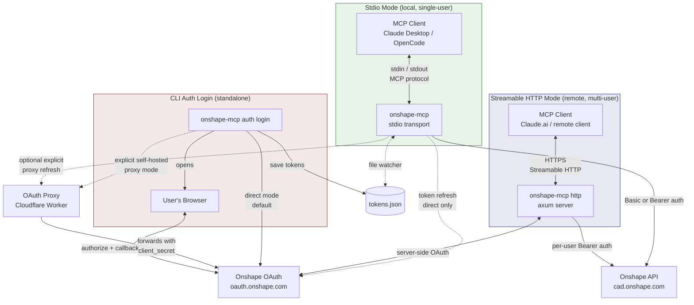
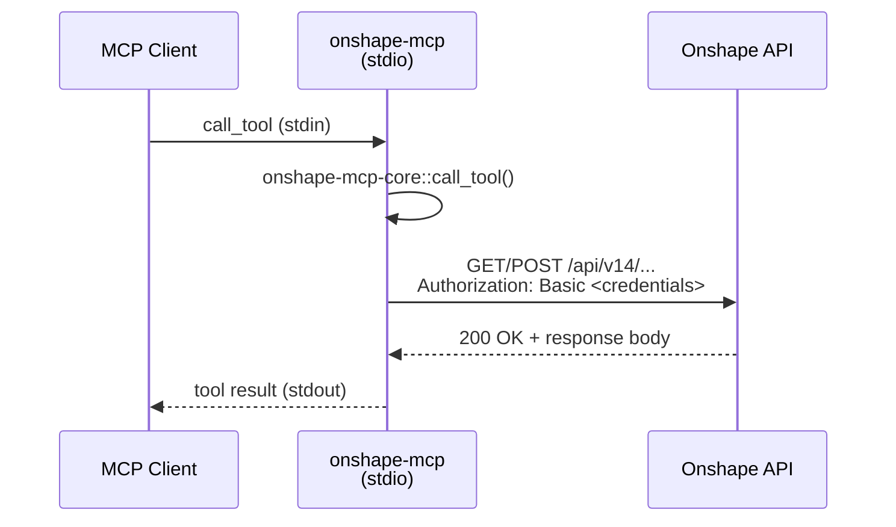
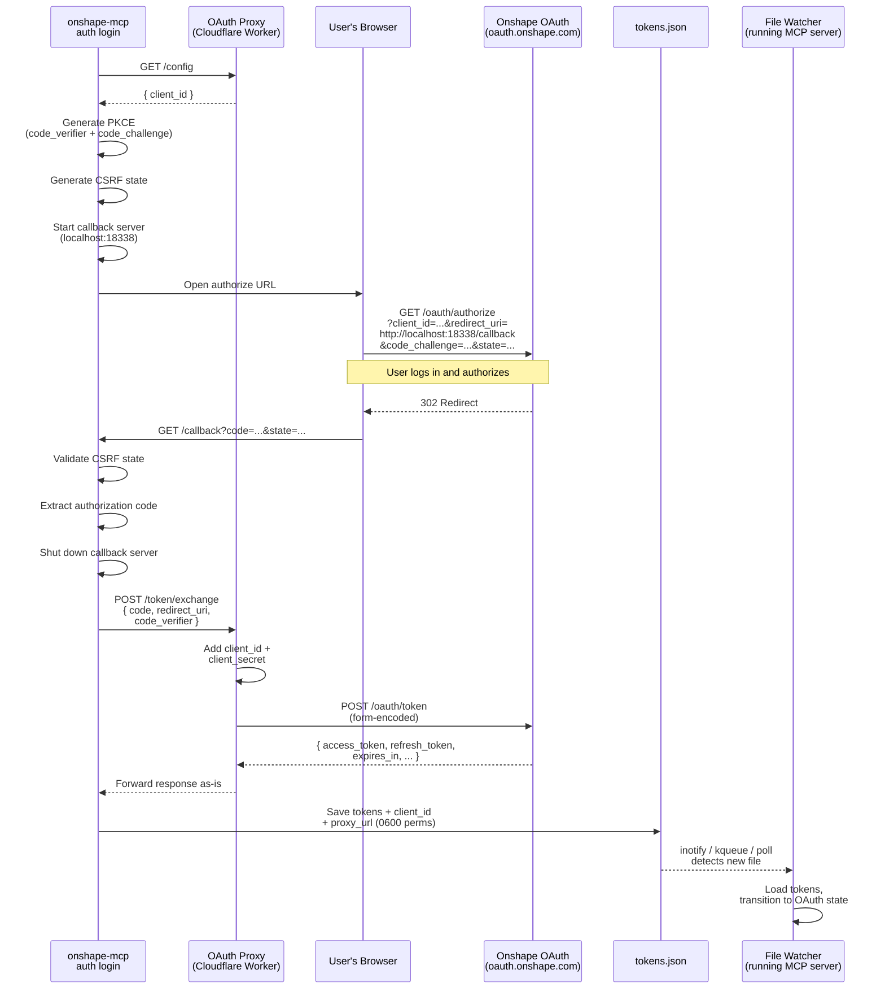
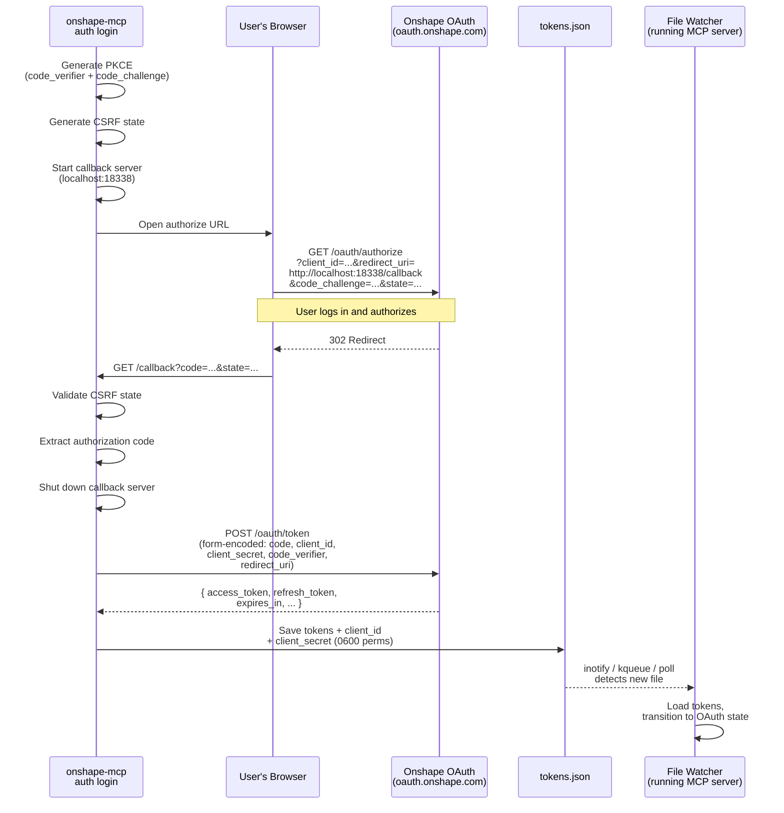
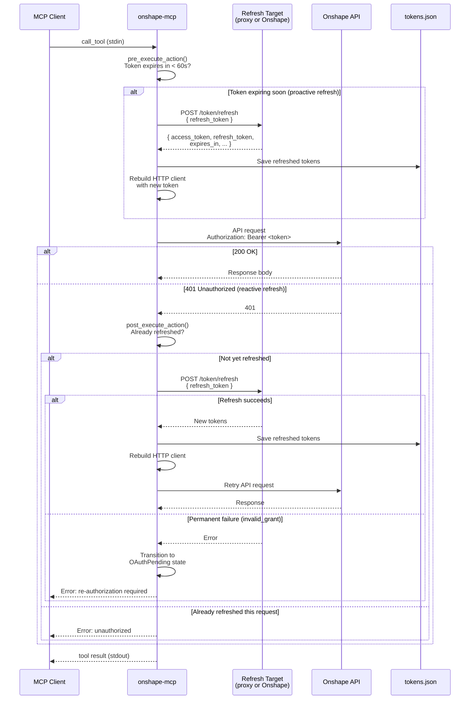
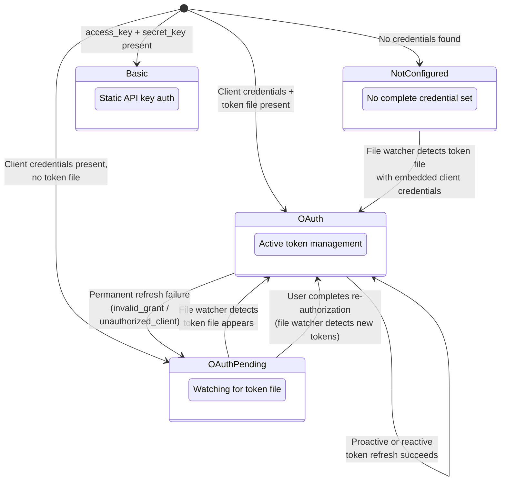
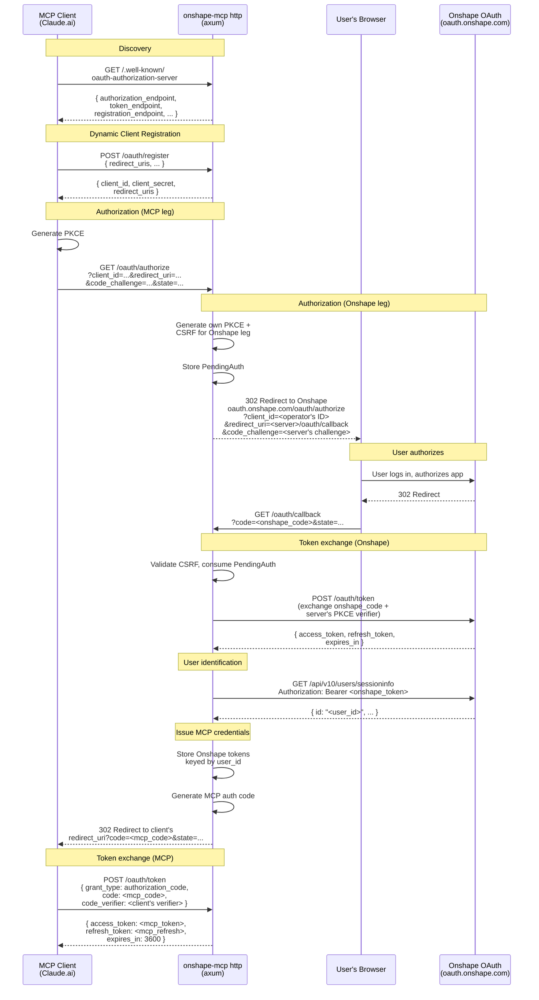
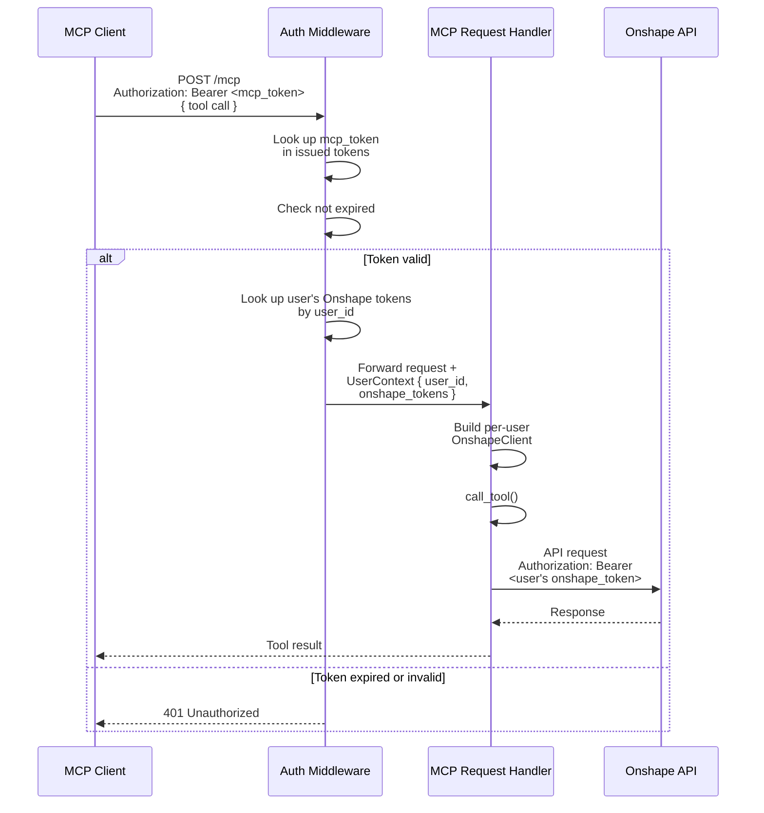
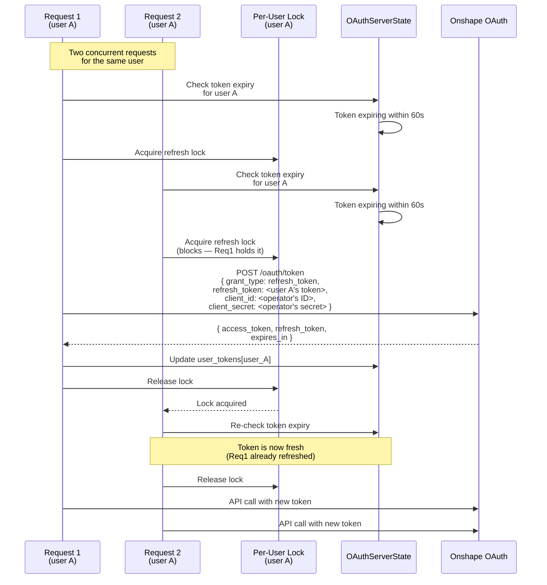

# Data Flow

This page contains sequence diagrams and state diagrams for the three operating
modes and their authentication lifecycles. For configuration details see
[Configuration](configuration.md); for auth credential sources see
[Authentication](authentication.md); for the OAuth proxy itself see
[OAuth Proxy](oauth-proxy.md).

## Operating Modes Overview

The MCP server has three operating modes. **Stdio** is the default for local
single-user use (Claude Desktop, OpenCode, etc.). **Streamable HTTP** is for
experimental, independently self-hosted remote multi-user deployments. No
public service is provided, and ChatGPT currently fails as tracked in
[#546](https://github.com/altendky/onshape-mcp/issues/546). **CLI Auth Login**
is a standalone command that completes the OAuth flow and writes a token file.

---

## Stdio Mode

### API Key Request Flow

When using API key (Basic) authentication, every request includes a static
`Authorization: Basic <base64(access_key:secret_key)>` header. There is no
token lifecycle — credentials are validated on first use.

### OAuth Login — Self-Hosted Proxy Mode

Optional explicit login flow. The CLI never sees the OAuth client secret — the proxy
adds it when forwarding to Onshape. The token file stores `proxy_url` so the
server knows to use the proxy for future refreshes.

### OAuth Login — Direct Mode

Default flow when the user provides both `client_id` and `client_secret`.
The CLI exchanges directly with Onshape — no proxy involved. The token file
stores `client_secret` so the server can refresh directly.

### OAuth Steady-State Request with Token Refresh

Each API request goes through a two-phase check: **proactive** (before the
request, if the token expires within 60 seconds) and **reactive** (after the
request, if Onshape returns 401). At most one refresh-and-retry occurs per
request.

### Authentication State Machine

The stdio server maintains an `ApiState` that governs which operations are
available. The file watcher and refresh outcomes drive transitions. The
`Basic` state is static (no transitions). `HttpOAuth` (used in HTTP mode)
is per-request and does not participate in this state machine.

---

## Streamable HTTP Mode

### Client Onboarding

Remote MCP clients (e.g. Claude.ai) discover the server's OAuth metadata,
register dynamically, and go through a double OAuth flow: the MCP client
authenticates to the MCP server, and the MCP server authenticates to
Onshape on behalf of the user. The server operator's Onshape OAuth app
credentials are used for the Onshape leg.

This mode does not use the local OAuth proxy. It is experimental, is not
broadly client-verified, and is operated only by independent self-hosters.

### Steady-State Request

Once onboarded, the MCP client includes its MCP bearer token on every
request to `/mcp`. The auth middleware validates the token and injects a
`UserContext` containing the user's Onshape credentials. The request handler
builds a per-user Onshape HTTP client for the API call.

### Per-User Onshape Token Refresh

The HTTP server manages Onshape tokens for each user independently. A
per-user lock prevents concurrent refresh races when multiple requests
arrive simultaneously for the same user. The operator's Onshape OAuth app
credentials are used for all refreshes.

